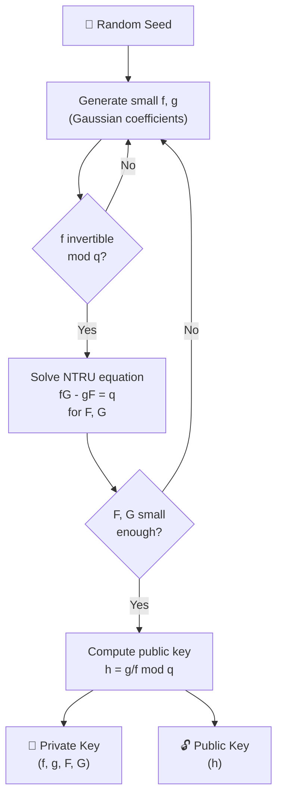
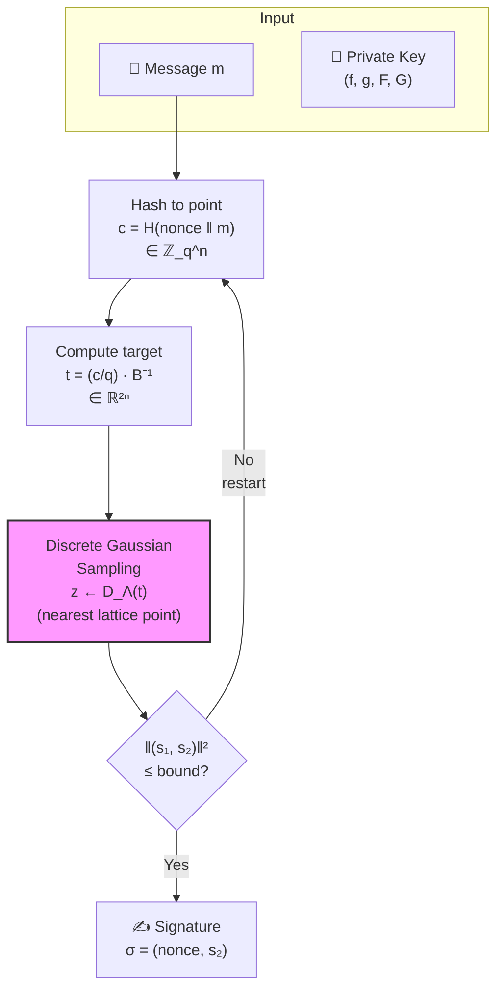
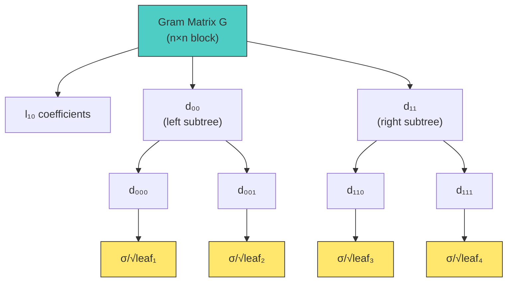
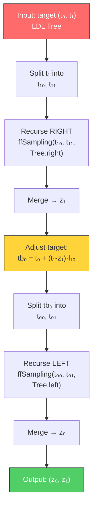
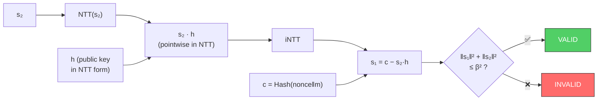
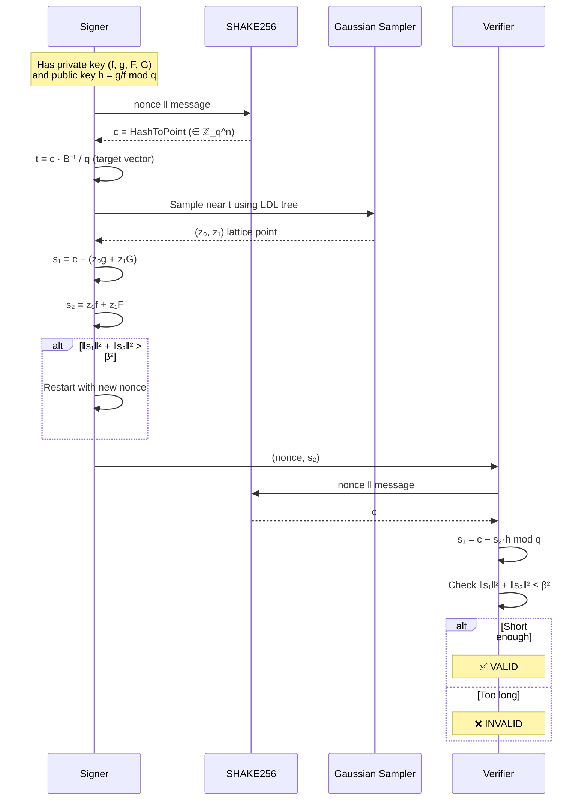

# Falcon (FN-DSA) — Mathematical Deep Dive

> **FIPS 206 · Post-Quantum Digital Signature Standard**
>
> This document explains *every mathematical step* of Falcon signing,
> from the underlying hardness assumption to the final verification
> equation. No prior lattice-cryptography background is assumed.

---

## Table of Contents

1. [The Big Picture — Why Falcon?](#1-the-big-picture--why-falcon)
2. [Mathematical Foundations](#2-mathematical-foundations)
3. [Key Generation](#3-key-generation)
4. [Signing — The "Hash-and-Sign" Paradigm](#4-signing--the-hash-and-sign-paradigm)
5. [Verification](#5-verification)
6. [Security: Why This Is Hard to Break](#6-security-why-this-is-hard-to-break)
7. [Concrete Parameters](#7-concrete-parameters)

---

## 1. The Big Picture — Why Falcon?

Traditional signatures (RSA, ECDSA) rely on number-theoretic problems that
a quantum computer can break with Shor's algorithm.

Falcon replaces them with a **lattice** problem:

> *Given a random lattice basis, find a short vector.*
>
> This is called the **Short Integer Solution (SIS)** problem —
> believed to be hard even for quantum computers.

### Mental Model

Think of a lattice as a 2-D grid of dots. The public key defines the grid.
The **private key** is a secret "shortcut" that lets you jump to a grid
point **near** a given target (the message hash). Without the shortcut,
finding a nearby point is computationally infeasible.

```
    ·   ·   ·   ·   ·   ·   ·   ·
  ·   ·   ·   ·   ·   ·   ·   ·
    ·   ·   ·   ☆   ·   ·   ·   ·      ☆ = message hash point
  ·   ·   ·   ●   ·   ·   ·   ·      ● = nearest lattice point (signature)
    ·   ·   ·   ·   ·   ·   ·   ·
  ·   ·   ·   ·   ·   ·   ·   ·
```

---

## 2. Mathematical Foundations

### 2.1 The Polynomial Ring

All Falcon arithmetic lives in the **cyclotomic polynomial ring**:

$$
R_q = \mathbb{Z}_q[x] / (x^n + 1)
$$

- **n** = 512 or 1024 (power of 2)
- **q** = 12289 (a prime, chosen so q ≡ 1 mod 2n for efficient NTT)
- Elements are **polynomials** of degree < n with coefficients in {0, 1, ..., q−1}
- Multiplication wraps around: x^n is replaced by −1

**Example (n = 4, q = 5):**

```
Let a(x) = 1 + 2x + 3x² + 4x³
Let b(x) = 1 + x

a(x) · b(x) mod (x⁴ + 1, 5):
= 1 + 2x + 3x² + 4x³ + x + 2x² + 3x³ + 4x⁴
= 1 + 3x + 5x² + 7x³ + 4x⁴
                              ↓  x⁴ → −1
= (1 − 4) + 3x + 0x² + 2x³  mod 5
= 2 + 3x + 0x² + 2x³
```

### 2.2 The NTRU Equation

At the heart of Falcon is the **NTRU** relation. Key generation produces four
small polynomials f, g, F, G ∈ R such that:

$$
f \cdot G - g \cdot F = q \pmod{x^n + 1}
$$

This is exactly the equation `fG − gF = q` in the ring R.

- **f, g** have very small coefficients (bounded by ~6)
- **F, G** have larger but still bounded coefficients
- The public key is **h = g · f⁻¹ mod q** (a single polynomial in R_q)

### 2.3 The Lattice

The four polynomials form a **2×2 matrix** of polynomials (the "NTRU basis"):

```
         ┌         ┐
    B =  │  g   −f │     (each entry is a polynomial in R)
         │  G   −F │
         └         ┘
```

This basis generates a **lattice** Λ in ℤ^2n:

```
Λ = { (s₁, s₂) ∈ R² : s₁ + s₂·h ≡ 0  (mod q) }
```

The key insight: **(f, g, F, G) are short** polynomials, so the rows of B
are short lattice vectors. This is the "trap door" — the private key.

An attacker only sees h (the public key), which defines the same lattice but
through a random-looking basis with **long** vectors. Finding short vectors in
that basis is the hard problem.

### 2.4 NTT — The Fast Multiplication Engine

The **Number Theoretic Transform** (NTT) is the "integer FFT". It converts
a polynomial from coefficient form to evaluation form, where multiplication
becomes pointwise:

```
  Coefficient form          NTT            Evaluation form
  ┌─────────────┐   ──────────────►   ┌──────────────────┐
  │ a₀ a₁ … aₙ₋₁│                    │ â₀  â₁  …  âₙ₋₁  │
  └─────────────┘   ◄──────────────   └──────────────────┘
                         iNTT

  Multiply in evaluation form:  ĉᵢ = âᵢ · b̂ᵢ  mod q
  Cost: O(n) instead of O(n²)
```

**q = 12289** was chosen specifically because 12289 − 1 = 12288 = 2¹² × 3,
so primitive 2n-th roots of unity exist mod q, enabling radix-2 NTT of length
up to 4096.

In the code (`vrfy.rs`):
- **g = 7** is the primitive root used for the NTT tables
- Montgomery multiplication with R = 4091 speeds up modular reductions

---

## 3. Key Generation



### Step by Step

1. **Sample f, g**: Draw coefficients from a discrete Gaussian distribution
   with small standard deviation σ. This gives polynomials with most
   coefficients in {−1, 0, 1} and a few ±2, ±3.

2. **NTRU Solver**: Find F, G satisfying fG − gF = q using the
   **Bézout-like algorithm** over polynomial rings. The code implements this
   via tower-of-fields recursive solving plus Chinese Remainder Theorem (CRT)
   reconstruction with big-integer arithmetic (`keygen.rs: zint_bezout`).

3. **Public key**: Compute h = g · f⁻¹ mod q in R_q. The inverse f⁻¹ mod q
   exists because f has no roots among the n-th roots of unity mod q (checked via NTT: all evaluations non-zero).

   In code (`vrfy.rs`):
   ```
   h[u] = mq_div_12289(g_ntt[u], f_ntt[u])   for each NTT slot u
   ```

---

## 4. Signing — The "Hash-and-Sign" Paradigm

Falcon uses the **GPV framework** (Gentry, Peikert, Vaikuntanathan) for
hash-and-sign signatures over lattices.

### 4.1 High-Level Flow



### 4.2 Step 1: Hash to Point

The message m is hashed to a polynomial c ∈ R_q:

```
nonce ← random(40 bytes)
c(x) = HashToPoint( SHAKE256(nonce ‖ m) )

Each coefficient cᵢ ∈ {0, 1, ..., q−1} is extracted from the
SHAKE256 stream, rejecting values ≥ q for uniformity.
```

In the code, `hm[u]` is this hash-to-point output — a polynomial with
coefficients modulo q = 12289.

### 4.3 Step 2: Compute the Target Vector

The signer needs to find a lattice point near the "target" derived from c.
The target is computed by multiplying c by the **inverse basis** B⁻¹:

$$
t = \frac{1}{q} \cdot c \cdot \widetilde{B}
$$

where B̃ is the **Gram-Schmidt orthogonalization** of B (the private basis).

Concretely, the code computes two target polynomials t₀ and t₁:

```
t₀ = FFT(c) · FFT(b₁₁) / q              ← multiply by column of B⁻¹
t₁ = FFT(c) · FFT(−b₀₁) / q             ← other column
```

Here b₀₁ = −f and b₁₁ = −F come from the basis matrix B = [[g, −f], [G, −F]].

**In code** (`sign.rs: do_sign_tree`, lines 636-650):
```rust
// Convert hash to FFT
fft::fft(&mut tmp[0..n], logn);
let ni = FPR_INVERSE_OF_Q;                // = 1/q

// t₀ = c · b₁₁ / q     (b₁₁ = −F)
fft::poly_mul_fft(&mut tmp[0..n], &b11[..n], logn);
fft::poly_mulconst(&mut tmp[0..n], ni, logn);

// t₁ = c · (−b₀₁) / q  (b₀₁ = −f, so −b₀₁ = f → multiply by −1)
fft::poly_mul_fft(&mut tmp[n..2*n], &b01[..n], logn);
fft::poly_mulconst(&mut tmp[n..2*n], fpr_neg(ni), logn);
```

### 4.4 Step 3: Discrete Gaussian Sampling (The Core Magic)

This is the heart of Falcon. Given the target (t₀, t₁), we need to sample
an integer vector (z₀, z₁) that is:
- **Close** to (t₀, t₁) — i.e., each zᵢ ≈ round(tᵢ)
- **Random** with a specific Gaussian distribution — so the signature
  doesn't leak information about the private key

This uses the **Fast Fourier Sampling (FFS)** algorithm.

#### 4.4.1 The Gram Matrix and LDL Tree

First, compute the **Gram matrix** G = B · Bᵀ of the private basis:

$$
G = \begin{pmatrix} \langle b_0, b_0 \rangle & \langle b_0, b_1 \rangle \\\ \langle b_1, b_0 \rangle & \langle b_1, b_1 \rangle \end{pmatrix}
$$

where b₀ = (g, −f) and b₁ = (G, −F). Each entry is a polynomial computed via:

```
G₀₀ = g·adj(g) + f·adj(f)     (= |b₀|²)
G₀₁ = g·adj(G) + f·adj(F)     (= ⟨b₀, b₁⟩)
G₁₁ = G·adj(G) + F·adj(F)     (= |b₁|²)
```

`adj(p)` means the **adjoint**: coefficients in reverse order with sign flip
(complex conjugate in FFT domain).

Then decompose G with **LDL factorization**:

$$
G = L \cdot D \cdot L^\dagger
$$

```
       ┌       ┐   ┌        ┐   ┌          ┐
  G =  │ 1   0 │ · │ d₀₀  0 │ · │ 1  l₁₀* │
       │ l₁₀ 1 │   │ 0  d₁₁ │   │ 0    1   │
       └       ┘   └        ┘   └          ┘

  l₁₀ = G₀₁ / G₀₀
  d₀₀ = G₀₀
  d₁₁ = G₁₁ − |G₀₁|² / G₀₀
```

This LDL decomposition is applied **recursively** in a binary tree
(the "ffLDL tree"). At each level, polynomials are split in half using
FFT split, and LDL is reapplied. The leaves contain the **per-coefficient
variances** σᵢ = σ / √(dᵢᵢ).



**In code** (`sign.rs: expand_privkey`):
```rust
// Build Gram matrix entries: G₀₀, G₀₁, G₁₁
// Then: ffldl_fft(tree, g00, g01, g11, logn, tmp)
// Normalise leaves: tree leaf = σ / sqrt(leaf_value)
ffldl_binary_normalize(&mut expanded_key[tree_off..], logn, logn);
```

#### 4.4.2 Fast Fourier Sampling Algorithm

The FFS algorithm traverses the LDL tree **bottom-up**, sampling one
integer at each leaf using a **discrete Gaussian sampler**:

```
FUNCTION ffSampling(t₀, t₁, Tree):
  if leaf:
    z₀ ← SampleZ(t₀, σ_leaf)     // sample integer near t₀
    z₁ ← SampleZ(t₁, σ_leaf)     // sample integer near t₁
    return (z₀, z₁)

  // Recursive step:
  (t₁₀, t₁₁) ← split(t₁)                    // FFT split
  (z₁₀, z₁₁) ← ffSampling(t₁₀, t₁₁, Tree.right)  // recurse right

  z₁ ← merge(z₁₀, z₁₁)                       // FFT merge

  // Adjust t₀ using the LDL factor l₁₀:
  tb₀ = t₀ + (t₁ − z₁) · l₁₀                 // propagate error

  (t₀₀, t₀₁) ← split(tb₀)                    // FFT split
  (z₀₀, z₀₁) ← ffSampling(t₀₀, t₀₁, Tree.left)   // recurse left

  z₀ ← merge(z₀₀, z₀₁)                       // FFT merge
  return (z₀, z₁)
```



**Key insight**: At the leaves, the sampler draws an integer z close to a
real number t with probability proportional to:

$$
\Pr[z] \propto \exp\!\left(-\frac{(z - t)^2}{2\sigma^2}\right)
$$

This is a **discrete Gaussian** centered on t with standard deviation σ.

#### 4.4.3 The Discrete Gaussian Sampler

The integer sampler uses **rejection sampling** with a base half-Gaussian:

```
FUNCTION SamplerZ(μ, 1/σ):
  1. s ← ⌊μ⌋,  r ← μ - s          // integer + fractional parts
  2. dss ← (1/σ)² / 2

  3. REPEAT:
       z₀ ← BaseSampler()          // half-Gaussian, σ₀ = 1.8205
       b  ← random bit
       z  ← b + (2b−1)·z₀          // fold to full Gaussian

       // Rejection: accept with probability ratio
       x ← (z − r)² · dss − z₀² / (2·σ₀²)
       Accept with probability  exp(−x) · (σ_min/σ)

  4. RETURN s + z
```

The base sampler (`gaussian0_sampler`) uses a precomputed cumulative
distribution table (`GAUSS0_DIST`) with 72-bit precision. The Bernoulli
trial `ber_exp` computes exp(−x) using Crandall's algorithm with 63-bit
fixed-point arithmetic.

### 4.5 Step 4: Recover the Signature

After sampling (z₀, z₁), compute the lattice point:

$$
(s_1, s_2) = (z_0, z_1) \cdot B = z_0 \cdot b_0 + z_1 \cdot b_1
$$

The actual signature components are:

```
s₁ = c − (z₀·g + z₁·G)    =  hm[i] − round(z₀·b₀₀ + z₁·b₁₀)
s₂ = −(z₀·(−f) + z₁·(−F)) = −round(z₀·b₀₁ + z₁·b₁₁)
```

**In code** (`sign.rs: do_sign_tree`, lines 677-711):
```rust
// z₀·b₀₀ + z₁·b₁₀ → tmp[2n..3n]
fft::poly_mul_fft(&mut tmp[2*n..3*n], &b00[..n], logn);
fft::poly_mul_fft(&mut tmp[3*n..4*n], &b10[..n], logn);
fft::poly_add(...);

// z₀·b₀₁ + z₁·b₁₁ → tmp[n..2n]
fft::poly_mul_fft(&mut tmp[n..2*n], &b11[..n], logn);
fft::poly_add(...);

fft::ifft(&mut tmp[0..n], logn);    // back to coefficient domain
fft::ifft(&mut tmp[n..2*n], logn);

// s₁[u] = hm[u] − round(tmp[u])
// s₂[u] = −round(tmp[n+u])
```

### 4.6 Step 5: Shortness Check

The signature is accepted only if the vector (s₁, s₂) is **short enough**:

$$
\|s_1\|^2 + \|s_2\|^2 \leq \beta^2
$$

where β² is a security-level-dependent bound. If the norm is too large
(which happens rarely, ~1% of the time), restart from Step 1 with a fresh
nonce.

The bound values from the standard:

| Level | n | β² |
|-------|---|----|
| FN-DSA-512 | 512 | 34,034,726 |
| FN-DSA-1024 | 1024 | 70,265,242 |

**In code** (`common.rs: is_short`): checks `‖s₁‖² + ‖s₂‖² ≤ bound`.

---

## 5. Verification

Verification is **simple and elegant** — it requires only the public key h, with no
knowledge of the secret basis (f, g, F, G).

### 5.1 The Verification Equation

Given **public key h**, **message m**, and **signature (nonce, s₂)**:

```
1.  c  = HashToPoint(SHAKE256(nonce ‖ m))     ← same hash as signing
2.  s₁ = c − s₂ · h   mod q                  ← recover s₁ from public info
3.  Accept iff  ‖s₁‖² + ‖s₂‖² ≤ β²           ← check shortness
```

**Why does this work?** During signing, we chose (s₁, s₂) such that:
```
s₁ + s₂ · h ≡ c  (mod q)
```
The verifier reconstructs s₁ = c − s₂·h and checks that both s₁ and s₂
are short.  An attacker cannot forge short (s₁, s₂) satisfying this
relation without knowing the secret basis — that would solve the hard
lattice problem (SIS).

### 5.2 Verification in Code



**In code** (`vrfy.rs: verify_raw`):
```rust
// Reduce s₂ mod q, then:
mq_ntt(tt, logn);                  // NTT(s₂)
mq_poly_montymul_ntt(tt, h, logn); // s₂ · h in NTT domain
mq_intt(tt, logn);                 // back to coefficients
mq_poly_sub(tt, c0, logn);         // tt = s₂·h − c = −s₁

// Normalise to signed range and check shortness
is_short(s1, s2, logn)
```

---

## 6. Security: Why This Is Hard to Break

### 6.1 Underlying Hard Problems

| Problem | Description | Best Known Attack |
|---------|-------------|-------------------|
| **SIS** (Short Integer Solution) | Given h, find short s₁, s₂ with s₁ + s₂·h ≡ 0 | Lattice sieving: 2^149 (n=512) |
| **NTRU** | Given h = g/f, recover short f, g | Lattice reduction: 2^126 (n=512) |
| **LWE** (Learning With Errors) | Related; Falcon security reduces to SIS on NTRU lattices | — |

### 6.2 Why Gaussian Sampling is Critical

If the signer just rounded (t₀, t₁) to the nearest integers, the signature
would **leak information** about the private key because the rounding errors
would be correlated with the secret basis vectors.

The discrete Gaussian distribution is the **unique** distribution that makes
signatures **statistically independent** of the private key (up to the public
lattice structure). This is why the GPV framework requires Gaussian sampling
— it provides a **zero-knowledge** property.

### 6.3 Side-Channel Defenses

- **Constant-time modular arithmetic**: `mq_add`, `mq_sub`, `mq_montymul`
  use branchless wrapping arithmetic to avoid timing leaks
- **Zeroization**: Private keys and PRNG state are zeroized on drop
- **Rejection sampling bound**: The sampler loop is capped at 1000 iterations
  to prevent infinite loops from PRNG failure

---

## 7. Concrete Parameters

### FN-DSA-512 (NIST Security Level I, ≈ AES-128)

| Parameter | Value |
|-----------|-------|
| Ring dimension n | 512 |
| Modulus q | 12289 |
| σ (signing Gaussian) | 165.736... |
| σ_min | 1.2778... |
| Signature bound β² | 34,034,726 |
| Public key size | 897 bytes |
| Signature size | ~666 bytes |
| Private key size | ~1281 bytes |

### FN-DSA-1024 (NIST Security Level V, ≈ AES-256)

| Parameter | Value |
|-----------|-------|
| Ring dimension n | 1024 |
| Modulus q | 12289 |
| σ (signing Gaussian) | 168.388... |
| σ_min | 1.2989... |
| Signature bound β² | 70,265,242 |
| Public key size | 1793 bytes |
| Signature size | ~1280 bytes |
| Private key size | ~2305 bytes |

### Full Pipeline Summary



---

> **Key Takeaway**: Falcon's elegance lies in the separation — the signer uses
> a short secret basis to "jump" near a target point in a lattice, while the
> verifier only needs to check that the jump landed close enough. The discrete
> Gaussian distribution ensures signatures reveal nothing about the secret
> shortcut, and the hardness of finding short lattice vectors without the
> shortcut keeps everything secure against both classical and quantum attackers.
